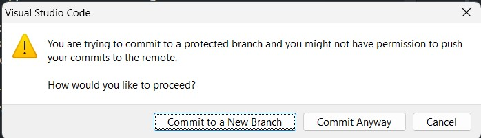

Recently Microsoft has released Visual Studio Code 1.68, and somethings in the [release notes](https://code.visualstudio.com/updates/v1_68) caught my eye:

- Git: Branch protection
- Git: Branch prefix
- Git: Branch name generation

## Git: Branch protection

With this option you can protect yourself from commiting to your main/master (or any other) branch.

In most team setups the main/master branch are only to be updated through a pull request, so that a code review is implicit. But how many times has it happened that you've opened your code to make a small change, commit, push and go grab a coffee as you've automatically triggered a pipeline to deploy the code change. When returning with a fresh, hot coffee, there is an error waiting for you and you realize that forgot to create a branch. I have to admit that it happens to me on average one time a month.

This isn't a huge problem, as VSCode and the [Gitlens](https://marketplace.visualstudio.com/items?itemName=eamodio.gitlens) extension make it easy for you to undo the commit. Doing this on the command line is a bit more daunting with the "git reset" command.

But prevention is better then resolving. This option will provide you with an dialogue box that allows you to first create the branch and than continue. There is of course the option to ignore and commit anyway.

## Git: Branch Prefix

These lines are in the release notes, which is a bit of a small explanation:

> To make the process of creating a new branch smoother, there is a new setting, git.branchPrefix, that specifies a string to use as a prefix when creating a new branch.

This option is useful when you (and your team) have standardized on branch names.\
In my team we use a branch strategy where the branch names are standardized and always start with "features/name/workitem-description. Where name is to be replaced with the name of the person creating the branch, workitem is to be replaced with the workitem id, and description is to be replaced with a description that makes it recognizable.\
These branch names are also used in the Azure DevOps pipelines, branches that start with "features" are only deployed to a test environment.

This feature saves me from forgetting and/or mistyping the branch name and in the worst case questioning myself why my push hasn't started the pipeline.

## Git: Branch name generation

This is, in my opinion, a nice option for less standardized branch names. So if you and your team haven't agreed on a naming convention, this can be a fun way of naming your branches. I immediately enabled this on my personal machine, and am actually using it for this blog. The name it came up with is "melted-opossum", which is good enough for me but might cause some confussion in larger team settings.

The names are generated by dictionaries, you can find the details in the release notes. See the image above for a suggested branch name.

## Drawbacks

Drawback is maybe a bit too strong of a word for it, but the improvements only work in VSCode. Which is not really a suprise, but still. If you're using Windows Terminal, Visual Studio or any other tools to create branches or commit your code, these features are not available.

## Conclusion

Three very nice additions to the already great tool that VSCode is. These are just some highlights from the complete [release notes](https://code.visualstudio.com/updates/v1_68), be sure the read the rest of them. There is also a release party schedule, which you can follow here on [youtube](https://youtu.be/t01EtPOKd_4).
