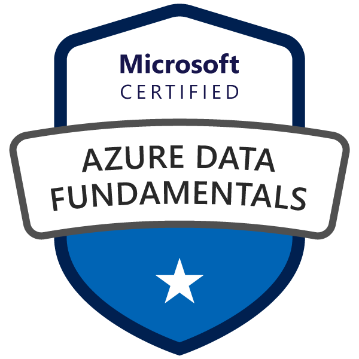

Yesterday I took and passed Exam DP-900: Microsoft Azure Data Fundamentals.

This certication is the first one in hopefully a series of new certifications, as I've started a learning path with my [employer][1].

## DP-900

According to [Microsoft][2], the following are the skills measured:

- Describe core data concepts (25-30%)
- Identify considerations for relational data on Azure (20-25%)
- Describe considerations for working with non-relational data on Azure (15-20%)
- Describe an analytics workload on Azure (25-30%)

Being a more old skool DBA with mostly relation database, or more specifically SQL Server, knowledge and experience, I was not completely confident about the topics that are not part of it. So my learnings for this exams basically were the other parts:

- Azure storage
  - Blob storage
  - File storage
  - Queue storage
  - Table storage
- Azure Cosmos DB
  - Azure Cosmos DB for NoSQL
  - Azure Cosmos DB for MongoDB
  - Azure Cosmos DB for Apache Cassandra
  - Azure Cosmos DB for Apache Gremlin
  - Azure Cosmos DB for Table
- The analytics parts
  - Azure Data Factory
  - Azure HDInsigth
  - Azure Synapse Analytics

Because I never really paid a lot of attention to these topics above, I learned quite a lot of things. Although the topics for the exam only touch the basics of these topics.

## Tools

As I mentioned earlier this exam is part of a track which is offered by my [employer][1], this also opened some new tools for me:

- A Cloud Guru
- Enterprise Skills Initiative

### A Cloud Guru

A Cloud Guru is a learning platform for helping its users to prepare for exams, also other than Microsoft. This is a paid service, which I got provided.\
Personally I really didn't like the way the material was presented. Maybe it was only this person, who uses a game shop story the bring across the story, or maybe it was the particulars of the story. It doesn't really matter, as it did work to get the points across.\
This was my first time using A Cloud Guru and I did like the parts of the hands on labs that were part of the learning material and were going through the needed and challenged you to look a bit further than required. At the end, it also provided a practice exam with exam like question style. This was also useful, as most of you know it is a particular way of formulating the questions and answers. So a little practice was good. These practice exams I could do multiple times and the order and questions changed. At the end of the practice exam you could go through the answers and it would explain why the answer is either good of bad.

### Enterprise Skills Initiative

When I booked the exam, I received an e-mail I can register for a practice exam with the Enterprise Skills Initiative. I had to sign in with my employers account, so I'm pretty sure this is not free for everyone. But I took the opurtunity to use it and do some more practice exams.\
There was an option to do two types of practice exams, but I only took one. The exam style practice goes through a number of questions and scores you like the normal exam would. At the end you can again go through all the questions and it will explain the answers.

### Microsoft learn

Further more, I just used the free Microsoft Learn paths that are offered on the [exam page][3]. These are more read, less video and I don't think it even had demos to created the services. But the many knowledge checks in between solidified that I've learned the topic from A Cloud Guru and the rest of the text is just a helpful reference from the videos.

## What's Next?

Next up is the [DP-203 Exam][3]. Going through the site this will really pull me out of my comfort zone and away from SQL Server. This has excited and scared at the same time. Hopefully you can read a similar post as this in the near future.

## Thanks

I do want to make an explicit thank you to my employer. They are open to let me decide the path I want to take and are fully supportive and offering tools to have me succeed. Thank you!

[1]: www.sogeti.com
[2]: https://learn.microsoft.com/en-us/certifications/exams/dp-900
[3]: https://learn.microsoft.com/en-us/certifications/exams/dp-203
